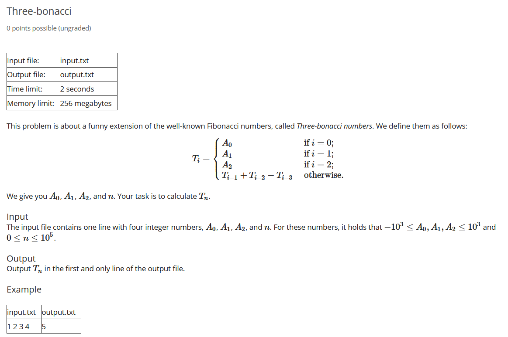

__101: read two integers from a file and output sum.__ <br>

- C: R/W from files using redirection from std I/O.
```c
#include <stdio.h>

int main() {
    int a, b;
    freopen("input.txt", "r", stdin);
    freopen("output.txt", "w", stdout);
    scanf("%d%d", &a, &b);
    printf("%d\n", a + b);
    return 0;
}
```
- C: R/W from files using FILE descriptor.
```c
#include <stdio.h>

int main() {
    FILE *infile = fopen("input.txt", "r");
    FILE *outfile = fopen("output.txt", "w");
    int a, b;
    fscanf(infile, "%d%d", &a, &b);
    fprintf(outfile, "%d\n", a + b);
    return 0;
}
```
```python
with open('input.txt', 'r') as infile, open('output.txt', 'w') as outfile:
    outfile.write(str(sum(int(v) for v in infile.readline().split())) + '\n')
```

__102: read two integers from a file (A,B) and output sum (A+B^2).__ <br>

- C: Cast 'b' to `long long` (64-bit).
```c
#include <stdio.h>

int main() {
    int a, b;
    freopen("input.txt", "r", stdin);
    freopen("output.txt", "w", stdout);
    scanf("%d%d", &a, &b);
    printf("%lld\n", a + (long long) (b) * b);
    return 0;
}
```
- C++: Cast 'b' to `long long` (64-bit).
```c
#include <fstream>

int main() {
    int a, b;
    std::ifstream("input.txt") >> a >> b;
    std::ofstream("output.txt") << a + (long long) (b) * b;
    return 0;
}
```
```python
with open('input.txt', 'r') as input:
    a, b = [int(x) for x in input.readline().split(' ')]
with open('output.txt', 'w') as output:
    output.write(str(a + b * b))
    output.write('\n')
```

__103: nth-term of tri-bonacci series.__ <br>
<center></center>

- C:
```c
#include <stdio.h>

int n, cache[100001];
char done[100001] = {1, 1, 1};

int run(int value) {
    if (!done[value]) {
        cache[value] = run(value - 1) + run(value - 2) - run(value - 3);
        done[value] = 1;
    }
    return cache[value];
}

int main() {
    freopen("input.txt", "r", stdin);
    freopen("output.txt", "w", stdout);
    scanf("%d%d%d%d", cache, cache + 1, cache + 2, &n);
    printf("%d\n", run(n));
    return 0;
}
```


